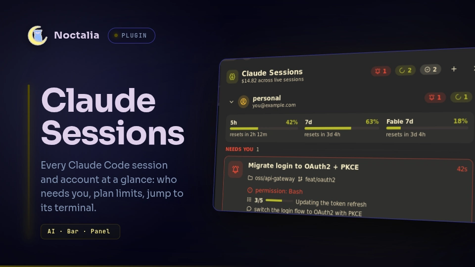

# Noctalia Plugins

Plugins for the [Noctalia](https://noctalia.dev) desktop shell (v5+), by [@lfdominguez](https://github.com/lfdominguez).

## Plugins

| | Plugin | Description |
| --- | --- | --- |
|  | **[Claude Sessions](claude-sessions/)**<br>`lfdominguez/claude-sessions` | Every Claude Code session at a glance, across all your accounts: which are working, which need you, what each is doing, your plan limits right on the bar, Remote Control sessions on your other machines, and one click to jump to its terminal (down to the exact kitty tab). |

## Installation

### From this repository

Add this repository as a plugin source in your Noctalia config:

```toml
[[plugins.source]]
name = "lfdominguez"
kind = "git"
location = "https://github.com/lfdominguez/noctalia-plugins"
enabled = true
```

Then enable a plugin from **Settings → Plugins**, or from a terminal:

```sh
noctalia msg plugins enable lfdominguez/claude-sessions
```

### For development

Clone the repository and link the plugin into Noctalia's local plugin folder. Edits to `.luau` files hot-reload.

```sh
git clone git@github.com:lfdominguez/noctalia-plugins.git
ln -s "$PWD/noctalia-plugins/claude-sessions" ~/.local/share/noctalia/plugins/claude-sessions
noctalia msg plugins enable lfdominguez/claude-sessions
```

## Layout

Each plugin is a top-level folder named after the part of its id after the `/`, the same layout as
[community-plugins](https://github.com/noctalia-dev/community-plugins). Each folder contains:

- `plugin.toml`, the manifest;
- its `.luau` entry scripts;
- a `README.md`;
- a `thumbnail.webp`;
- `translations/en.json`.

See each plugin's README for its requirements, usage and settings.

## License

[MIT](LICENSE)
