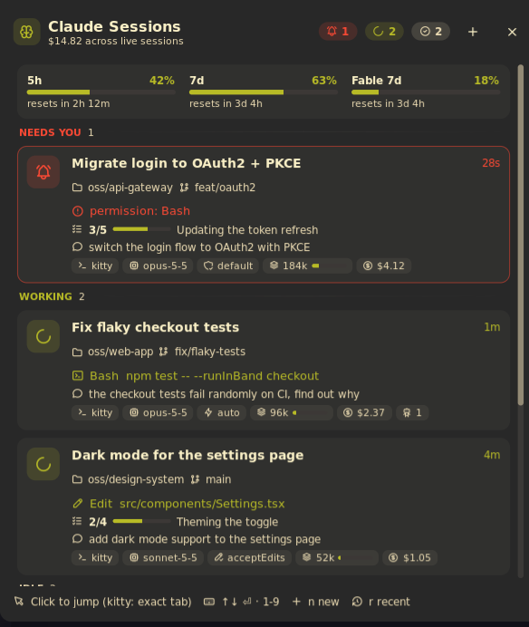

# Claude Sessions

See every running [Claude Code](https://claude.com/claude-code) session from your bar: which ones are working,
which are waiting for you, what tool each is running, and how close you are to your plan limits. Click a session to
jump straight to its terminal, down to the exact kitty tab.



## Plugin

| Field | Value |
| --- | --- |
| ID | `lfdominguez/claude-sessions` |
| Entries | Bar widget: `bar`; panel: `panel`; service: `poller`; launcher provider: `search` |
| Launcher Prefix | `/cs` |

## Requirements

- Claude Code 2.1 or newer (it writes the per-session state files this plugin reads).
- `jq` on `PATH`.
- `curl` on `PATH`, used to fetch plan limits when `claude-dashboard` is not installed (see Notes).
- `xdg-open` for the "open folder" and "open transcript" actions.
- A supported compositor for focusing windows: Hyprland (`hyprctl`, classic or Lua config), niri (`niri`) or sway
  (`swaymsg`). On other compositors everything works except jumping to a session's window.
- Optional: `kitty` with remote control enabled. kitty sessions get exact tab/split focusing, and new or resumed
  sessions open as kitty tabs. Add to `kitty.conf` and restart kitty:

  ```conf
  allow_remote_control socket-only
  listen_on unix:@kitty-{kitty_pid}
  ```

  Without kitty (or for sessions running in another terminal) clicking a session focuses its terminal window, and
  new sessions open in Noctalia's configured terminal.

## Usage

Add **Claude Sessions** to a bar from the widget picker. It shows one dot per session (red: needs you, accent:
working, grey: idle) and a bell when a session is waiting. Hover it for a summary; click it to open the panel:

```sh
noctalia msg panel-toggle lfdominguez/claude-sessions:panel
```

The panel shows:

- **Plan limits**: 5-hour, 7-day and per-model weekly usage with reset countdowns.
- **Sessions** grouped into *Needs you*, *Working* and *Idle*. Each card has the task title, project folder and git
  branch, what Claude is doing right now (tool and argument) or what it is waiting for, your last prompt, todo
  progress, and chips for terminal, model, permission mode, context size, cost, running subagents and last turn time.
- **Recent**: closed sessions you can resume.

Click a card to jump to its terminal. Hover it (or select it with the keyboard) for actions: open a shell in the
project, open the folder, copy a `claude --resume` command, open the transcript, or stop the session (click twice).
The **+** button starts a new Claude session in a recent project.

Keyboard: `↑`/`↓` select, `Enter` jumps, `1`-`9` jump to a session directly, `n` new session, `r` toggle Recent,
`Esc` closes.

In the launcher, type `/cs` followed by part of a title or project path, for example `/cs api`. Activating a live
session jumps to it; activating a recent one resumes it in a new terminal.

## Settings

| Setting | Type | Default | Description |
| --- | --- | --- | --- |
| `notify_waiting` | `bool` | `true` | Desktop notification when a session starts waiting for input or a permission. |
| `notify_finished` | `bool` | `true` | Desktop notification when a session goes from working to idle. |
| `finished_min_minutes` | `int` | `2` | Only send the "finished" notification for turns at least this many minutes long. |
| `hide_idle_hours` | `int` | `0` | Hide live sessions that have been idle longer than this many hours. `0` shows all. |
| `recent_count` | `int` | `8` | Closed sessions listed under Recent and in the launcher. `0` disables Recent. |
| `bar_style` | `select` | `dots` | `dots`: one dot per session. `counts`: waiting count and busy/total. |
| `work_root` | `folder` | empty | Project paths under this folder are shown relative to it (e.g. `~/Work`). Empty shows full paths. |
| `context_window` | `int` | `1000000` | Context window size in tokens, used to draw the context gauge. |

## IPC

```sh
# Toggle the panel from the bar widget on the focused output (handy for a compositor keybind)
noctalia msg plugin lfdominguez/claude-sessions:bar focused click

# Re-scan sessions and limits now
noctalia msg plugin lfdominguez/claude-sessions:poller all refresh
```

## Notes

Everything is read locally except plan limits:

- **Sessions** come from `~/.claude/sessions/*.json` (written by Claude Code), polled every 2 seconds. Stale files of
  crashed sessions are ignored by checking `/proc/<pid>`.
- **Details** (title, tool, todos, model, context, cost) are read from the session transcript in
  `~/.claude/projects/` by `details.sh`, only when the transcript changes. Your last prompt comes from
  `~/.claude/history.jsonl`. Cost is an estimate from token usage and `~/.claude/pricing-cache.json`.
- **Terminal detection** reads the session process's environment (`/proc/<pid>/environ`) for `KITTY_PID` /
  `KITTY_WINDOW_ID` / `TERM_PROGRAM`. Nothing else from it is kept.
- **Plan limits**: if the `claude-dashboard` Claude Code plugin is installed and its cache
  (`~/.cache/claude-dashboard/cache-*.json`) is under 5 minutes old, it is used as-is. Otherwise `limits.sh` calls
  `https://api.anthropic.com/api/oauth/usage` at most every 5 minutes with Claude Code's own OAuth token from
  `~/.claude/.credentials.json`. The token is only read (never refreshed or written), is passed to `curl` on stdin so it
  does not appear in the process list, and is never logged. If it has expired the call is skipped until Claude Code
  refreshes it. This is the only network access.
- **Spawned processes**: `jq`, `grep`, `tail`, `find` (data extraction); `kitty @`, `hyprctl` / `niri msg` / `swaymsg`
  (focusing and opening tabs); `xdg-open`; `kill -TERM <pid>` when you stop a session; `claude --resume` when you
  resume one.
- **Files written**: none.
