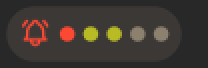

# Claude Sessions

**Every [Claude Code](https://claude.com/claude-code) session at a glance, right in your Noctalia bar.**
See which sessions are working, which are waiting for you and what each one is doing, keep an eye on your plan limits,
and jump to any session's terminal in one click, down to the exact kitty tab.


## Features

- 🔔 **Know when you're needed.** Sessions waiting for a permission or an answer jump to the top, turn the bar icon
  into a red bell and send a desktop notification.
- ⚙️ **See what each session is doing.** The tool it's running (`Bash: npm test`, `Edit: src/app.ts`, …), its todo
  progress, your last prompt, model, permission mode, context size and estimated cost.
- 📊 **Plan limits.** 5-hour, 7-day and per-model weekly usage (e.g. Fable) with reset countdowns.
- 🎯 **Jump to the terminal.** Click a session to focus its window; on kitty it lands on the exact tab or split.
- ⏪ **Resume and start sessions.** Reopen recently closed sessions, or start a new one in a recent project.
- ⌨️ **Keyboard and launcher.** Navigate the panel without a mouse, or search sessions from the launcher with `/cs`.
- 🖥️ **Works on Hyprland, niri and sway.**

## Plugin

| Field | Value |
| --- | --- |
| ID | `lfdominguez/claude-sessions` |
| Entries | Bar widget: `bar`; panel: `panel`; service: `poller`; launcher provider: `search` |
| Launcher Prefix | `/cs` |

## Requirements

| Requirement | Why |
| --- | --- |
| Claude Code 2.1+ | It writes the per-session state files this plugin reads. |
| `jq` | Reads session state and transcripts. |
| `curl` | Fetches plan limits when `claude-dashboard` isn't installed (see [Privacy](#notes)). |
| `xdg-open` | The "open folder" and "open transcript" actions. |
| `hyprctl`, `niri` or `swaymsg` | Focusing a session's window on Hyprland (classic or Lua config), niri or sway. On other compositors everything else still works. |
| `kitty` *(optional)* | Exact tab/split focusing, and opening new or resumed sessions as kitty tabs. |

### kitty integration (optional)

kitty sessions get the best experience: clicking one switches to its exact tab or split, and new or resumed sessions
open as tabs in your most recently used kitty. Enable remote control in `kitty.conf`, then restart kitty:

```conf
allow_remote_control socket-only
listen_on unix:@kitty-{kitty_pid}
```

Sessions running in any other terminal (or in kitty without remote control) still work: clicking one focuses its
terminal window, and new sessions open in Noctalia's configured terminal.

## Usage

### Bar widget

Add **Claude Sessions** to a bar from the widget picker.



It shows one dot per session, sorted by status:

| Dot | Meaning |
| --- | --- |
| Red (with a bell icon) | Needs you: waiting for a permission or an answer |
| Accent color | Working |
| Grey | Idle |

Hover it for a summary of every session and your plan limits. Click it to open the panel. Prefer numbers? Set
**Bar style** to *Counts*.

### Panel

Open it from the bar widget, or bind this to a key:

```sh
noctalia msg panel-toggle lfdominguez/claude-sessions:panel
```

From top to bottom:

1. **Plan limits.** One meter per usage window, with a reset countdown.
2. **Sessions.** Grouped into *Needs you*, *Working* and *Idle*. Each card shows the task title, project folder and
   git branch, what Claude is doing right now (or what it's waiting for), todo progress, your last prompt, and chips
   for terminal, model, permission mode, context size, cost, running subagents and last turn time.
3. **Recent.** Closed sessions you can resume (click the header to expand).

**Click a card** to jump to its terminal. **Hover it** (or select it with the keyboard) to reveal its actions:

| Action | What it does |
| --- | --- |
| ▶ Resume *(recent only)* | Reopens the session with `claude --resume` in a new terminal tab |
| Shell | Opens a shell in the project folder |
| Folder | Opens the project folder in your file manager |
| Copy | Copies a `cd … && claude --resume …` command |
| Transcript | Opens the session's transcript file |
| Stop *(live only)* | Stops the session; click twice to confirm |

The **+** button in the header starts a new Claude session in one of your recent projects.

#### Keyboard

| Key | Action |
| --- | --- |
| `↑` / `↓` | Select a session |
| `Enter` | Jump to the selected session |
| `1`–`9` | Jump straight to that session |
| `n` | New session |
| `r` | Show or hide Recent |
| `Esc` | Close |

### Launcher

Type `/cs` followed by part of a session title or project path, for example `/cs api`. Live sessions are listed
first: activating one jumps to it. Activating a recent session resumes it in a new terminal.

## Settings

Open them from **Settings → Plugins → Claude Sessions**.

| Setting | Type | Default | Description |
| --- | --- | --- | --- |
| `notify_waiting` | `bool` | `true` | Desktop notification when a session starts waiting for input or a permission. |
| `notify_finished` | `bool` | `true` | Desktop notification when a session goes from working to idle. |
| `finished_min_minutes` | `int` | `2` | Only send the "finished" notification for turns at least this many minutes long. |
| `hide_idle_hours` | `int` | `0` | Hide live sessions that have been idle longer than this many hours. `0` shows all. |
| `recent_count` | `int` | `8` | Closed sessions listed under Recent and in the launcher. `0` disables Recent. |
| `bar_style` | `select` | `dots` | `dots`: one dot per session. `counts`: waiting count and busy/total. |
| `work_root` | `folder` | empty | Project paths under this folder are shown relative to it (e.g. `~/Work`). Empty shows full paths. |
| `context_window` | `int` | `1000000` | Context window size in tokens, used to draw the context gauge. |

## IPC

```sh
# Toggle the panel from the bar widget on the focused output (handy for a compositor keybind)
noctalia msg plugin lfdominguez/claude-sessions:bar focused click

# Re-scan sessions and plan limits now
noctalia msg plugin lfdominguez/claude-sessions:poller all refresh
```

## Notes

### Privacy and data access

Everything is read locally. The only network access is the optional plan-limits call described below.

| What | Where it comes from |
| --- | --- |
| Live sessions | `~/.claude/sessions/*.json`, written by Claude Code and read every 2 seconds. Leftover files from crashed sessions are ignored by checking `/proc/<pid>`. |
| Session details | The session transcript in `~/.claude/projects/`, read by `details.sh` only when it changes. |
| Last prompt | `~/.claude/history.jsonl` |
| Cost | Estimated from token usage and `~/.claude/pricing-cache.json`. |
| Terminal | The session process's environment (`/proc/<pid>/environ`), checked once for `KITTY_PID`, `KITTY_WINDOW_ID` and `TERM_PROGRAM`. Nothing else from it is kept. |
| Plan limits | See below. |

**Plan limits.** If the [`claude-dashboard`](https://github.com/uppinote20/claude-dashboard) Claude Code plugin is
installed and its cache (`~/.cache/claude-dashboard/cache-*.json`) is less than 5 minutes old, it is used as-is.
Otherwise `limits.sh` calls `https://api.anthropic.com/api/oauth/usage`, at most once every 5 minutes, with Claude
Code's own OAuth token from `~/.claude/.credentials.json`. The token is:

- only read, never refreshed or written;
- passed to `curl` on stdin, so it doesn't appear in the process list;
- never logged or handed to the plugin's Luau code.

If the token has expired, the call is skipped until Claude Code refreshes it.

**Processes it runs:**

- `jq`, `grep`, `tail` and `find` to extract data;
- `kitty @`, `hyprctl`, `niri msg` or `swaymsg` to focus windows and open tabs;
- `xdg-open`;
- `kill -TERM <pid>` when you stop a session;
- `claude --resume` when you resume one.

**Files written:** none.

### Troubleshooting

- **Clicking a kitty session doesn't switch tabs.** Remote control isn't enabled for that kitty. Add the two lines
  above to `kitty.conf` and restart kitty; windows opened before the change keep the old behaviour.
- **Plan limits are missing.** Make sure Claude Code is logged in. If you rely on `claude-dashboard`, its cache only
  refreshes while a session is redrawing its status line.
- **Logs.** Script errors are logged to `~/.cache/noctalia/noctalia.log` under `[luau]`.
